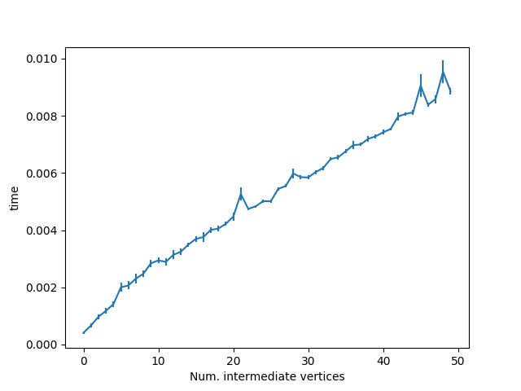

## DAG timing

This is the forward-pass time for DAGs with a variable number of intermediate vertices, and fixed IO dimension and batch size (10). 
Gets into the tens of milliseconds for a single forward pass on my laptop with a modest graph size. And it's linear, as that's how I've coded the 
forward pass ATM.

Of course the real problem is that right now all my graph computation is *serial, node-by-node*. So even if the graph becomes super sparse I'll still have this linear scaling. 

Ideally I'd do some preprocessing for optimization:
    * Dropping vertices that don't contribute to the output
    * Topological sorting of vertices prior to computing (can just do this once) -- allows equal-depth nodes to be updated simultaneously

Regarding the latter point -- maybe the easiest thing to do is just export to TF computational graphs?

Oh and what's up with those spikes?