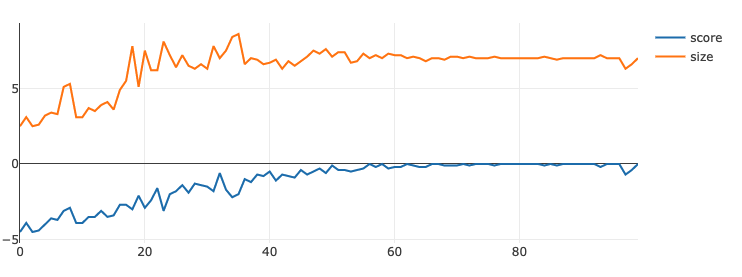

## learn_fixed_length_001

A check that the daggen code behaves as expected: teach the graphrnn to output graphs of a fixed length.
Training is via "policy gradient".

### Result
As one would hope this is not too hard to train.
Here's an example of training (sacred experiment id 683) which plots the cost function (minus the difference between specified and sampled sizes) and
batch graph size as a function of update step.

I used a running-average baseline, hidden size 10. Not much more to say here -- backprop seems to work. 