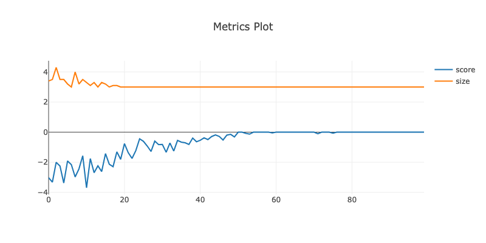

## Learning a target graph

Question: suppose I fix a target computational graph (one that I know can be represented exactly by the model) -- can I learn a distribution that's peaked near it by asking the outputs to agree over randomly sampled inputs?

### results
I put the target function as the sum of the two inputs, batched over ten random-normal inputs. 

Has no trouble learning to add. Also note that the graph size settles down to the minimum possible for this task (3) rather quickly. 